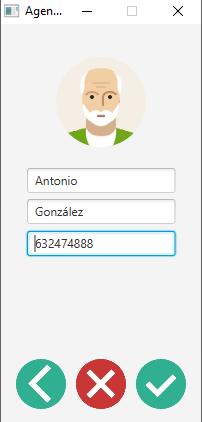

# **Contacts**

Interactive contact book 📖 with options to import ⬇️ and export ⬆️ to plain text, binary and XML.

## **Table of contents**

- [**Contacts**](#contacts)
  - [**Table of contents**](#table-of-contents)
  - [**General info**](#general-info)
  - [**Demo**](#demo)
  - [**Screenshots**](#screenshots)
  - [**Technologies**](#technologies)
  - [**Setup**](#setup)
  - [**Usage**](#usage)
  - [**Status**](#status)
  - [**Contact**](#contact)

## **General info**

**Date**: April, 2019.  
**Duration**: 1 Month.

It was a deliverable practice of creating a contact book with **Java** and **JavaFx**, but I wanted to go further and made it similar to what the "Contacts" phone application is. With all the options that this implies, add, edit, delete and search for contacts. It also allows adding images and the possibility of importing and exporting to plain text, binary and XML the entire agenda.

## **Demo**

You can try it downloading the [**Jar**](https://github.com/udsgit/contacts/raw/master/dist/K4Emmanuel.jar).

> <br><i>Demo</i>

## **Screenshots**

> 
> <br><i>Example of agenda with 6 contacts and when entering one of them.</i>

## **Technologies**

- **Java**
- **Java Fx**

## **Setup**

1. Clone or download the repository.

```console
git clone https://github.com/udsgit/contacts.git
```

2. Open project with your **IDE** (In my case I used NetBeans).
3. Done, you can run it from there.

## **Usage**

1. Just download and install the [**Jar**](https://github.com/udsgit/contacts/raw/master/dist/K4Emmanuel.jar) or if you have cloned it, you can run it from the same IDE when compiling it.
2. When you run it, the initial menu will appear with the options to add a new contact or import and export agendas.
3. When you add a contact, you can optionally change the image by clicking on it and choosing the one you want from your computer or you can use the test images that we include in the repository within "src/resources/people".
4. After you add several contacts, you can make a backup by choosing in which format you want to export it.
5. And you can also import the backup.

## **Status**

Project is: **_Completed._**

Because the App Contacts is functional and after having gone through different versions I consider the project completed.

## **Contact**

Created by [@Emmanuel](https://www.linkedin.com/in/emagleza/), feel free to contact me!
